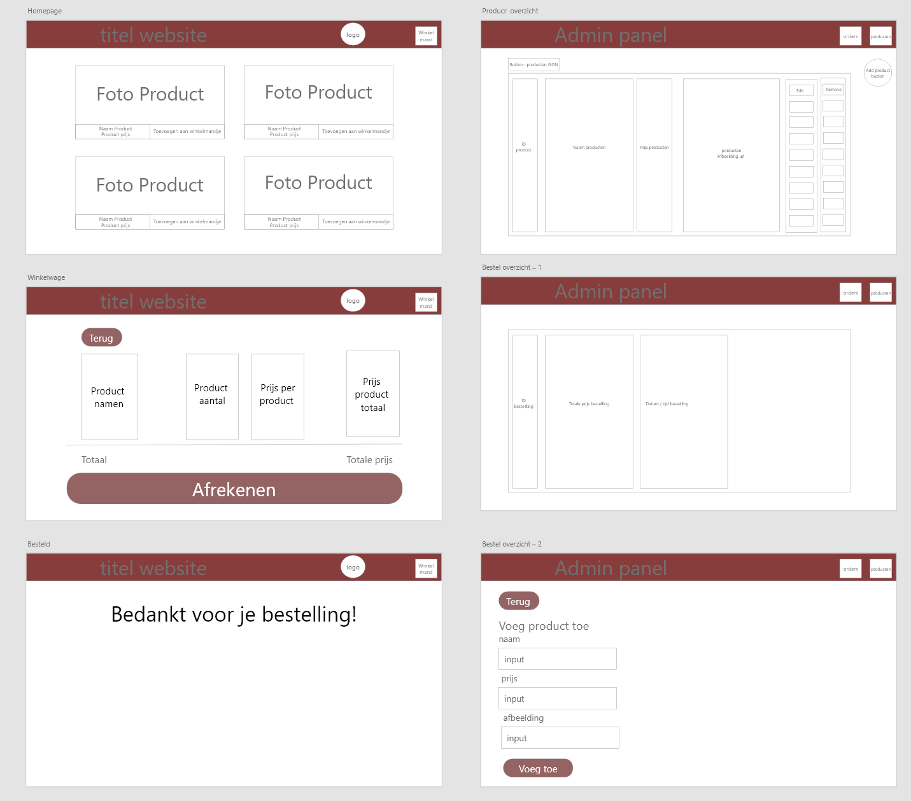
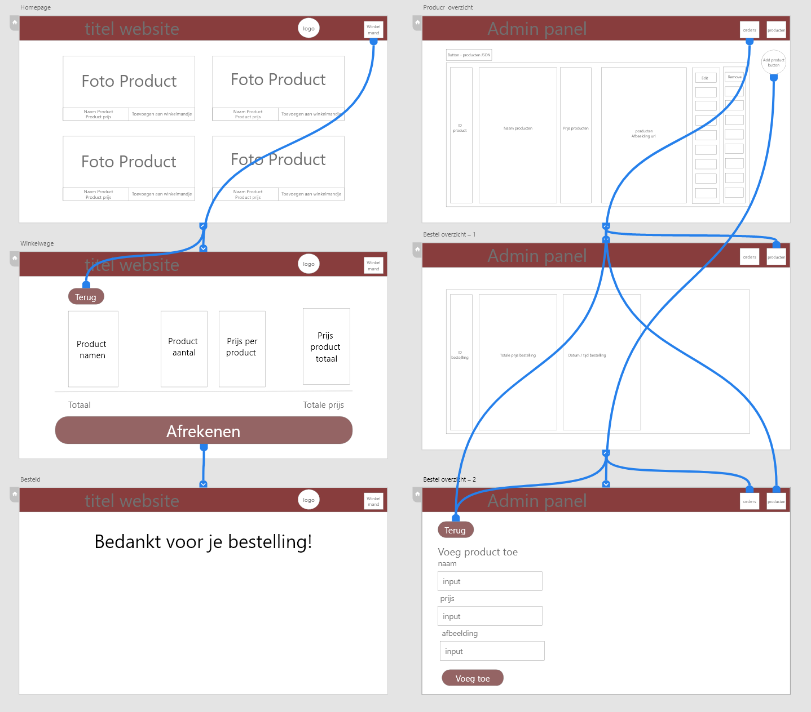

# Planning webshop

## Type website
Ik maak een webshop website waar je spullen kan bestellen die online worden gezet door mensen waardoor je die ook gaat kunnen kopen als ze online staan. Ook komt er een interface voor de admins en kunnen die daar hun eigen dingen zien achter de schermen zoals de id nummers van de producten of kunnen ze admin only dingen zien.

## Functionaliteiten
In de website gaan verschillende functies komen te zitten:
* Bestellen
* Product overzicht
* Producten toevoegen (admin-only)
* Producten verwijderen (admin-only) 
* Producten wijzigen (admin-only)

## Gebruikte technieken
De onderstaande technieken worden gebruikt in de website
* Objects
* Functies
* Arrays
* local storage
* Variabelen

## Website styling

### Wireframe

###
